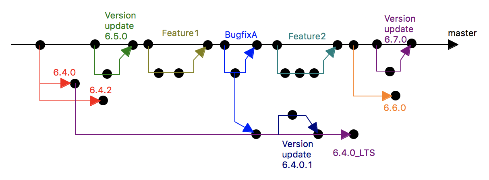

---

This work is licensed under the Creative Commons CC0 License

---

# Enhanced Delivery Mechanism
### xtUML Project Technical Note


## 1 Abstract
The goal of this issue is to modify the BridgePoint release strategy to provide supported 
stable builds with longer lifetimes.  

An enhanced release strategy must deal with the following concerns:  
* How does the BridgePoint community decide when a new (Long Term Support) LTS release is 
brought to life?
* How long (calendar time wise) are LTS releases supported?
* Who decides what master commits will be back-patched onto open LTS versions?

Once the strategy is expounded, this document will analyze what process changes are required 
to implement the strategy.  

## 2 References
[1] Ubuntu LTS, https://wiki.ubuntu.com/LTS  
[2] xtUML Organization on Github, https://github.com/xtuml  
[3] BridgePoint Issue Tracker, https://support.onefact.net  
[4] Debian Branches, https://en.wikipedia.org/wiki/Debian#Branches   
[5] Debian LTS, https://wiki.debian.org/LTS   

## 3 BridgePoint Development
### 3.1 Source Code
BridgePoint source code is hosted on github in the xtUML organization [2]. The ```bridgepoint```, 
```mc```, ```packaging```, ```pt_antlr```, and ```bptest``` repositories hold different pieces.  Each 
repository has multiple user forks.  Each repository has a master branch that contains the “latest and 
greatest” code.  The xtUML organization repositories also contain many version branches that mark the 
code base at various points in time, for example: *v5.0.0*, *v6.4.0*, etc.  User forks of the xtUML 
repositories are used for feature and bug fix development.  Features and fixes are tied to issues in 
the issue tracker [3].  Once developers have completed new work (including testing), they submit a 
changeset to the xtUML organization upstream repository via a pull request.  Pull requests are 
reviewed and tested by core committers and serviced into the *master* branch.

### 3.2 Builds
A Jenkins build server is used to build the BridgePoint application.  Core committers can kick off 
“nightly builds” that build the *master* branch.  They can also kick off “branch builds” that build a 
specified branch from a specified fork.  These builds may be published to a download host for anyone 
in the world to access.  

Nightly builds and branch builds (both also known as “engineering builds”) are considered cutting edge, 
and users should expect them to have undergone limited testing.  The automated test suites may or may 
not have been run as part of the build.  

### 3.3 Releases
One Fact sponsors new releases of BridgePoint Pro at least twice a year.  These builds are for 
commercial users that require stability and support.  BridgePoint Pro releases are built from versioned 
branches of the source code repositories.  These builds are run through the full automated test suite 
and then are put through a manual test suite by the the BridgePoint development team.  BridgePoint Pro 
releases are made available to One Fact customers.  

Nightly builds are published regularly and in the open, but are not tied to any specific schedule.  

BridgePoint Community Editions are published in the open, but not on any schedule.  

## 4 Long Term Support Options
### 4.1 Overview
There are various maintenance strategies used by software teams to produce “LTS” (Long Term Support) 
releases / versions.  LTS products are stable releases that are maintained for an extended period 
with important bug patches driven by the user community or compelling events.  LTS versions allow 
users to validate a release and accept only small important fixes and not have to do additional 
validation of many new features, enhancements, and fixes.   

In the following, we explore two options, both sharing the common goals:  
* LTS versions are stable and targeted at developers that require a longer lifecycle in their 
development tools.  They receive important bug fixes or carefully selected compelling changes.  
* LTS versions are not feature driven or cutting edge.  They do not change regularly.  

### 4.2 Ubuntu-like Time Based Approach
The following BridgePoint LTS strategy draws inspiration from the Ubuntu LTS strategy [1].  

**The BridgePoint development team will create a new major LTS version every two years.**  For example, 
if an LTS version is created based on the code base of the BridgePoint Pro release in June 2017, 
the next major LTS version shall be created around June 2019.  

**LTS versions shall live for 3 years.**  Continuing the example above, the June 2017 LTS will go 
out of support in June 2020.  This overlap gives LTS users plenty of time (one year) to migrate from 
one LTS version to another.  

### 4.3 Debian-like Continuous Multi-branch Approach
A different strategy is the method Debian uses for branches and releases [4].  In this approach, 
multiple release and pre-release branches coexist at the same time.  

Features and fixes are initially added to the *unstable* branch with very limited testing.  As time 
and additional testing progress, the changed software is promoted into the *testing* branch.  Eventually 
the *testing* branch is frozen for a few months of bug fixes and then becomes the *stable* branch and 
the current release. From this point until the next release the *stable* branch is updated only for 
important security or usability fixes.   

When a new *stable* branch is created, the prior one becomes *oldstable* and is is supported for the 
next five years by the Debian LTS community [5].   

The Debian process is similar to the development process currently used by the BridgePoint development 
team.  The BridgePoint *master* branch is basically the same as Debian *testing*.  Debian’s notion of 
*unstable* is skipped because all BridgePoint code changes are accompanied by some tests before 
promotion to master.  

When a new version of BridgePoint Pro is released, the xtUML development team creates a 
*v<Major>.<Minor>.<Revision>* branch that is roughly equivalent to the creation point of Debian *stable*.  

Here the processes diverge and is the key point of “what happens next” and the notion of Long Term 
Support.  Debian *stable* automatically goes into LTS.  BridgePoint features and fixes are added to 
*master* and not back-patched onto old releases.  

## 5 BridgePoint Process Effects
Managing LTS branches requires oversight and adds a non-trivial amount of overhead to the development 
and release of new BridgePoint versions.  

The process requires careful tracking of fixes that are candidates to be patched onto active LTS 
versions.  These issues must be undergo consultation and review by the development team and customer.  

Once the issue is marked for LTS inclusion, a committer must:  
1. Perform the merge  
2. Increment the appropriate versions  
3. Build and Test (repeat as needed)  
3.1. Build  
3.2. Choose Appropriate Tests  
3.3. Run selected tests  
3.4. Address any issues found  
4. Distribute the new LTS build to the customer base  

The amount of effort to perform the above steps increases as time moves on and the LTS code base 
ages and build infrastructure may change and advance.  

## 6 Proposal
A strict Ubuntu-like time based approach does not fit well with BridgePoint development and 
maintenance at this time.  A modification of the current strategy that adds stability-driven 
customer-supported LTS builds will be used.  

In the new process the development team will create a new LTS branch off of a tagged BridgePoint Pro 
release branch in response to a customer request or community-driven compelling event.  

At the time of creation, interested parties will agree on the starting BridgePoint Pro version of 
the LTS branch and duration of the life of the new LTS branch.  Releases of BridgePoint Pro during 
the life of a prior LTS branch have no effect on those LTS branches other than the fact that a bug 
fix included in the BridgePoint Pro release may also have been marked to be back-patched onto the LTS.   

### 6.1 LTS Update Requests and Decision Making
BridgePoint community members will raise issues in the BridgePoint issue tracker and tag them 
specially as a request to patch a certain commit onto LTS branches.  Users are even encouraged to 
create pull requests for the commit onto the LTS branches and include a link to the pull request in 
the issue.  

A committee of BridgePoint core developers shall consult on whether the change is to be applied to 
active LTS versions.  It is possible a change could be accepted onto one LTS branch but not another. Input 
from all parties shall be considered, but the final decision shall rest with one person given the role 
of LTS Maintainer.  

### 6.2 Branch Management
LTS branches will follow the rule that version numbers are unique and always advancing.  Colloquially 
a version branch will be known based on where it started from (such as ```6.4.0_LTS```), but any patched 
releases of an LTS will be uniquely numbered.  

Figure 1 shows how the master branch continually moves forward with features and fixes, but the LTS 
branch only moves forward slowly.  

  
**Figure 1**

### End
