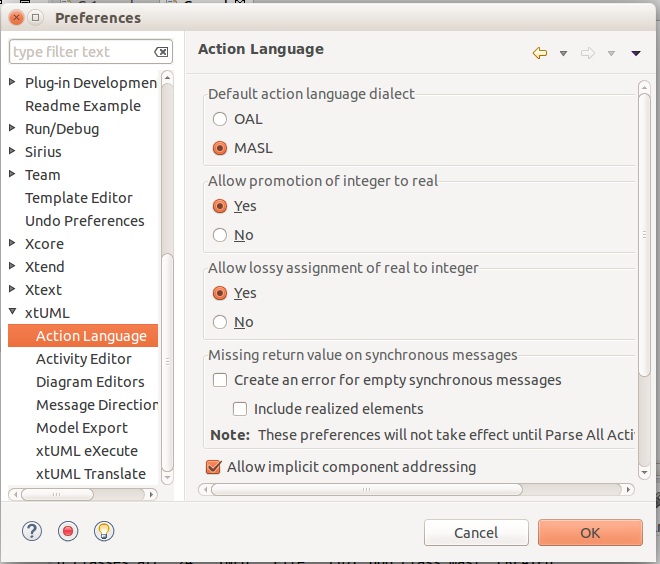

MASL Modeling and Conversion Guide
===================
     
## 1 Introduction

BridgePoint xtUML is designed to support the executable, translatable UML (xtUML) approach 
to the Shlaer-Mellor methodology for Model-Driven Architecture (MDA). However, xtUML is not 
the only language to have its roots in this MDA approach. MASL  is another dialect that has 
evolved from the Shlaer-Mellor methodology and developed a community of users. Now this 
common ancestry offers modelers in either community the potential to move models between 
the two dialects. BridgePoint xtUML is an editing and execution platform for xtUML 
modelers. With the addition of conversion tools, extensions to import/export facilities and 
a MASL-aware editor, BridgePoint xtUML is a powerful platform for MASL modelers to advance 
their work and employ MASL downstream tools. When moving MASL models into xtUML, an idiom 
must be followed. This document details that idiom and the extensions to the platform that 
make working with MASL inside BridgePoint xtUML possible.     


## 2 Terminology and Notation

In this document terms preceded by _MASL_ are as defined in the MASL Reference Manual 
unless otherwise clarified below.   
  
| Term                  | Description                          |
|-----------------------|--------------------------------------|
| __eclipse workspace__ | A workspace can hold any number of xtUML projects. On disk it is a folder with special eclipse configuration data. |
| __eclipse project, xtUML project __ | A project can hold any number of xtUML model elements. On disk it is a folder with metadata and configuration specific to the project. |
| __domain component__  | An xtUML component representing a MASL Domain |
| __domain package__    | An xtUML package containing everything associated with a particular MASL Domain, including the domain component for the domain |
| __project component__ | A project-specific xtUML component representing the bridge mappings for the project |
| __project package__   | An xtUML package representing a MASL Project |
| __shared type__       | A type used outside a MASL Domain, including one used within two or more MASL Domains as well as any used on terminator services |
| __eclipse view__      | A graphical presentation of project information |
| __eclipse perspective__ | A collection of views that provide a consistent presentation of the project information along with tools to manipulate the model |  
  
When describing procedures that involve BridgePoint menus or xtUML model element selections, 
the following notation is used:  

| Action             | Meaning                              |
|--------------------|--------------------------------------|  
| &lt;RMB&gt;        | Right-Mouse Button |
| &lt;click&gt;      | Select using left-mouse button |
| &lt;dbl-click&gt;  | Two rapid &lt;click&gt;s |
| __&lt;Text-in-bold&gt;__  | A menu selection |
| __&lt;Text-in-bold&gt; >__ | A sequence of progressive menu selections |   
  

## 3 The MASL - xtUML Modeling Idiom

To ensure that MASL models and their usage of bridging MASL Project components are 
accurately represented in xtUML, a set of recommendations and restrictions must be followed. 
Collectively these form the MASL-xtUML modeling idiom and are the foundation for model 
representation and error-free MASL export with BridgePoint xtUML.  
  
Since MASL and xtUML are based on the Shlaer-­Mellor Method, the two languages are similar 
at the core. Consequently, most mappings between constructs in the two languages are 
straight­forward (e.g., MASL Object maps to xtUML Class) and are therefore not detailed 
here. However, each language has been extended differently, leading to some mappings that 
are less obvious. These differences are explained in the sections below.  
  
The idiom addresses three areas of concern: bridge technologies between domains, model 
packaging to maintain visibility, and type mapping. By following the practices outlined in 
the MASL-xtUML modeling idiom, models that start as MASL can be converted to xtUML, 
modified inside the xtUML Editor and exported back to textual MASL for processing by 
downstream tools.  
  
### 3.1 Maintaining MASL Bridging Flexibility Inside xtUML

Systems are typically constructed by connecting multiple MASL Domains (xtUML components) 
using some form of bridging technology. Where MASL employs terminators and public services, 
xtUML uses interfaces consisting of interface operations and ports. The basic mappings 
between MASL and xtUML are simple: a service declared on a terminator corresponds to an 
interface operation on a port with a required interface while a public service surfaced by 
a MASL Domain is rendered as a function invoked by a port activity in an identically named
operation in a provided interface.  
  
MASL bridging provides flexibility in the way MASL Domains can communicate. For example, a 
MASL Domain may use a subset of the services surfaced by another MASL Domain, and it may 
choose to refer to those services by names different than the MASL Domain providing them. 
Also, a forking bridge allows a MASL Domain to view as a single service two or more 
services provided by any number of MASL Domains.  
  
Since xtUML provides bridging based on a single definition for each interface, it is 
necessary to introduce a bridging component into the MASL system that replicates MASL’s 
flexibility. The idiom illustrated below offers the same level of domain isolation in xtUML 
that the MASL approach affords.  
  
// TODO - use new GPS Watch
  
__Figure 1__  

In Figure 1, magenta rectangles are references to reusable domain components while the 
green rectangle is a project component that implements the project­-specific bridge 
requirements.  
  
Each component representing a MASL Domain sprouts a single provided interface containing an 
interface operation for each public service surfaced by the MASL Domain as declared in the 
MASL Domain interface file. This provided interface covers all incoming interface 
operations for the domain component, and the complementary interface is always located on 
the project component.  

A special naming convention for ports must be followed when creating a MASL Project 
component (the green component in Figure 1) from scratch. After the provided interface is 
formalized, the port must be renamed from its default name (e.g. "Port1") to 
`<domain>__<terminator>` with the double-underscore separating the domain and terminator 
names.  

### 3.2 Domain Services and Terminator Services 

As previously stated, MASL Domain services are modeled in BridgePoint as a function inside 
a component and a matching operation in a provided interface on the component boundary. See 
`clear()` and `key()` of the calc domain in Figure 2. By convention, the port name and this 
provided interface are renamed by the modeler to match the component (MASL Domain) name. 
The `Publish to interface...` tool is available on the context menu of functions shown in 
Model Explorer.  This tool helps the user keep the interface operations in synch with 
changes made to the signatures of the domain services.  The tool is described in more 
detail in [BridgePoint Context Menu Tools](../../UserInterface/BridgePointContextMenuTools/BridgePointContextMenuTools.html).  

If there is a domain service without a matching provided operation, it represents a private 
domain service in MASL. Thus, the existence of a matching operation in the provided 
interface provides access to the corresponding domain service and therefore makes it 
public. Without a matching operation in the provided interface, a domain service is private    
to the domain.

MASL terminators and terminator services are modeled in BridgePoint as a required interface
implementing interface operations on the component boundary. See the "disp" terminator and 
the `error()` and `result()` terminator services in Figure 2.   
 
The dialect property of the domain services and terminator services are important. 
For a MASL Domain, all provided operations should have dialect "None" and required 
operations (i.e. terminator services) should have dialect "MASL". The xtUML function inside
the component that implements the domain service has dialect "MASL".   

For a MASL Project it is the opposite. All provided operations should have dialect "MASL" 
and required operations have dialect "None". For MASL Domains and MASL Projects 
that are converted and imported the dialect properties are configured automatically.   

  
__Figure 2__  

### 3.3 MASL Projects

There are some situations when the editor must distinguish between a MASL Domain and MASL 
Project. Because MASL Domains are where the majority of the work will take place, no 
special annotation is needed. For MASL Projects however, the description field of the 
package that contains a project component must contain the string "masl_project".  This 
value must be set _before_ the package is populated with a Component (MASL Project) and 
Component References (MASL Domains).   

For MASL Projects that are converted and imported into BridgePoint, this description field 
is set automatically.  

TODO - show screenshot  

## 4 xtUML Model Packaging for System-wide MASL Visibility

### 4.1 Packaging Overview  

Under xtUML, model elements defined within one component have no knowledge or visibility of 
model elements (including types) defined within another component. This is different from 
MASL where public types defined within a MASL Domain can be accessed by other MASL Domains 
using a qualified name of the form:  `otherDomainName::someType`.  

The conversion process packages a MASL Domain as a xtUML component. Thus, the types defined 
within that MASL Domain become invisible to other components of the system.  To deal with 
these differences in scoping, rules in the organization of the model are needed to 
maintain system-wide visibility. We call these rules the MASL-xtUML Idiom.    

### 4.1 MASL-xtUML Idiom Packaging Requirements 

All interface declarations and shared types, including types used on terminator services, 
must be packaged outside the component (MASL Domain)  definitions.   

Each MASL Domain converted to an xtUML model contains a top-level package which then 
contains:  

* a single component definition representing the MASL Domain  
* shared types and all interface definitions associated with the MASL Domain  

A top-level package may also be included that contains structural types and type references.  
  
To support system-side visibility, BridgePoint’s support for inter-project references (IPR) 
is leveraged. The xtUML Project in a workspace that is a MASL Project will enable IPRs and 
thus will gain access to the components, interfaces, and types shared by the MASL Domain 
projects in the workspace. IPRs should remain off for domain projects.

TODO - goes with Figure 1 - update to match
  
__Figure 3__  
  
A typical xtUML project using this approach is illustrated in Figure 3. Note that all 
shared types defined in the MASL Domain are contained within the Shared package associated 
with that MASL Domain, and these type definitions are not included in the component 
representing the MASL Domain.   

> With BridgePoint xtUML, the conversion facility produces a single xtUML model file 
> adhering to the packaging and naming scheme illustrated. Modelers are free to repackage 
> and rename their models as they see fit, so long as these two conditions are met:  
> * all elements shared among components are defined outside the components that refer to them  
> * all elements associated with a MASL Domain reside within the domain package for that MASL Domain  
  
Types that a domain intends to make public to the outside world should be created in the 
"Shared" package that is a sibling to the component (domain).  The "Shared" package also 
includes the interfaces that are mapped to MASL Domain functions and terminator services.   

Types that a domain intends to keep private from the outside world should be created in a 
package underneath the component (domain).   

When this idiom for packaging is used, the MASL export facility produces a MASL Domain 
interface file (`<domain>.int`) that includes the shared types, domain services, and 
terminators of the domain.    
   
### 4.2 Keeping xtUML and MASL Types Separate

The MASL type system does not align perfectly with that of xtUML. So, during import of a 
converted model, no MASL types are mapped to xtUML types. The entire MASL type system is 
adopted into the xtUML Editor. These MASL core types are stored in the top-level `types` 
package of a converted and imported model. 

### 4.3 Type References

In xtUML typing is established through a link between the model element being typed and a 
particular instance of a type. However, MASL treats a type reference as a first ­class 
concept which makes typing a model element in MASL slightly more complex than it is with 
xtUML. This is because a type reference in MASL can further constrain the type that is 
applied to the affected model element. Type references may be used to type structural 
model elements or variable declarations inside MASL activities.  

Type references must be used to add constraints to types, use collection types, or instance 
types. To use these types, create a new public type and enter the full type reference as 
the type name. For example, a type named `sequence of integer` could be used to type an 
element which is a sequence of the type `integer`.

> NOTE: MASL allows modelers to constrain sequence types with a max size. Only integer 
> literals are allowed to be used to constrain sequences when the type is used to type an 
> activity parameter or a return type. If the type is used to type a local variable, an 
> attribute, or a structure member, any constant expression of type integer may be used in 
> a sequence constraint.

### 4.4 Using Shared Types

To access shared types from other domains in MASL action language, the modeler must create 
a dependency to the `<other domain>.int` file into the local project's 
[Dependencies project preferences](../../UserInterface/xtUMLModeling/Preferences/ProjDependencies.html).  

To access shared types from other domains in the structural part of the model, the modeler 
must create a type reference in the local domain.  This is done by creating a new UDT in 
the current domain with a special name that references the domain where the type actually 
lives (e.g. `OtherDom::someType`).   
* TODO - Where in the local domain should this go?
* TODO - What is special about the local UDT, is it based on MASLtype?


## 5 BridgePoint Extensions for MASL

The MASL extensions added to BridgePoint include: 
* MASL-xtuml conversion tools 
* extending the BridgePoint Import/Export facilities
* a MASL-aware Editor  

Each of these enhanced facilities are described in the sections below.  

### 5.1 MASL Model Conversion

The conversion of MASL Domains and MASL Projects into MASL-infused xtUML models is 
performed by the tool `masl2xtuml` and is invoked from the command line. The conversion 
command `masl2xtuml`  has the following syntax for MASL Domains:  

`masl2xtuml -d <directory path> -o <directory path>`  
  
and for MASL Projects  
  
`masl2xtuml -p <directory path> -o <directory path>`  
   
where `<directory path>` is any relative or absolute directory path, `-d` identifies 
the MASL Domain, `-p` identifies the MASL Project directory and `-o` identifies the 
destination directory where the xtUML model file is written to. A complete [reference is 
included in the MASL documentation](../masl2xtuml/masl2xtuml.html).   
   
The MASL Domains and MASL Projects are processed one at a time in any order. All conversion 
can be performed sequentially or each conversion can be followed by a BridgePoint model 
import. 
    
Note that MASL models can be converted in any order. These converted MASL Domain models may 
be imported into the workspace in any order.  However, before importing a xtUML model 
representing a MASL Project, all MASL Domains referenced by that MASL Project must first be 
imported. Additionally, IPRs must be enabled on the xtUML Project where the converted MASL 
Project `<project>.xtuml` file is to be imported.   
   
### 5.2 MASL Import Extension

The xtUML Import wizard is extended to handle MASL models that have been converted to
xtUML.  

As described earlier, the MASL-xtUML idiom organizes the BridgePoint workspace based on 
projects, and an xtUML project is needed for each converted MASL Domain and MASL Project. 

It is important to recall that the MASL-xtUML idiom requires system-wide scope for some 
model elements and this is facilitated in BridgePoint using Inter-Project References. For 
IPRs to automatically connect referenced model elements during import, these referenced 
elements must already be in the workspace. Consequently, the converted MASL Project must 
only be imported after all referenced MASL Domains have been imported. MASL Domains can be 
imported into the workspace in any order.   

#### 5.2.1 BridgePoint Model Import from the xtUML Modeling Perspective

To perform each import from inside BridgePoint, the xtUML Modeling perspective is used following these 
steps:   
   
1. Create an xtUML project using __File > New > xtUML Project__. This command will ask for 
a name which must be unique among all projects in the workspace. A descriptive name that 
includes a connection to the original MASL Domain or MASL Project is suggested.
2. If this project will contain a MASL Domain, skip to the next step.  If it will contain a 
MASL Project, enable the Inter-project References preference using the steps described in 
section 5.4.3.
3. Select __File > Import__ to start a model import. This will open the Import wizard.
4. Expand the xtUML folder and select xtUML Model from the list of import sources.
5. After __&lt;click&gt;__ ing on Next, enter the full path to the MASL-infused xtUML model file 
to be imported. Pressing the Browse button will open a file browser where __&lt;click&gt;__ s are 
used to navigate through the folder list down to the file to be imported.
6. Once the path is entered, __&lt;click&gt;__ Finish to initiate the import.
7. Upon completion, the Model Explorer view will be updated to show the newly imported 
model.
   
### 5.3 MASL Export Extension

The conversion of xtUML models to MASL is a single step operation that is invoked from 
either the xtUML Modeling perspective or a command line. The MASL Export extension consists 
of the `xtuml2masl` conversion tool and enhancements to the BridgePoint Export facility to 
support the Export MASL Domain or Export MASL Project flows.   

#### 5.3.1 MASL Export from the xtUML Modeling Perspective

The steps to export an xtUML model to MASL from BridgePoint start with the Model Explorer 
view. Here the source xtUML project is selected by clicking on the package containing the 
project to be exported as either a MASL Domain or MASL Project.   

The conversion is activated by selecting __&lt;RMB&gt; > Export MASL Domains__  or 
__&lt;RMB&gt; > Export MASL Project__ appropriately. During the export process, progress is 
reported in the Console view, and if errors occur an error log will appear at completion of 
the operation.  
  
#### 5.3.2 MASL Export from the Command line

To export xtUML models to MASL equivalent models without invoking the BridgePoint UI, the 
`xtuml2masl` tool is used. This tool makes use of the environment variable `WORKSPACE` 
which must be set to the directory path of the xtUML workspace holding the source xtUML 
project. It is recommended that all xtUML projects be contained in a single workspace, 
however this is not enforced by the export tool. If the complete xtUML model is contained 
across multiple BridgePoint workspaces then the `WORKSPACE` variable must be modified 
between `xtuml2masl` invocations.   
  
To invoke the MASL export tool, the following syntax is used  
```
xtuml2masl  -i <eclipse project path> -d <package name> [-o <output directory> ]  |  
-i <eclispe project path> -p <package name> [-o <output directory> ]
```  

See the `xtuml2masl` [reference page in BridgePoint Help](../xtuml2masl/xtuml2masl.html) 
for complete details. Note, if the `-o` parameter is omitted, the current directory is used 
by default.  

### 5.4 MASL Editor Extensions

Once a MASL model has been imported as an xtUML project, BridgePoint extensions for MASL 
are accessed through the xtUML Modeling perspective. These extensions to the perspective 
enable MASL-aware code editing and MASL export.   
  
#### 5.4.1 The xtUML Modeling Perspective

When working with xtUML and MASL inside BridgePoint, the xtUML Modeling perspective is used 
exclusively. This perspective consists of four primary views:  
* Model Explorer provides tree-based navigation of the model.  
* Graphical Editor for editing component, class and state machine diagrams. Each diagram 
type provides a palette of graphical diagram elements.  
* Console displays error and information messages when models are built.  
* Properties provides access to the list of properties associated with the currently 
selected model element.  
  
Each of these views is documented in the BridgePoint Help facility which can be accessed 
through __Help > Help Contents__.  

A popular addition to the default xtUML Modeling perspective is the Navigator view which 
provides easy navigation of the files and directories contained within an xtUML project. 
This view can be added from within BridgePoint by selecting __Window > Show View > Navigator__.
   
Each model element has an editor that can be opened in a number of ways. Since the xtUML 
Modeling perspective is model-aware, model elements can be opened from within editors and 
views. The most common view for navigating and opening model elements is the Model 
Explorer. In this view, model elements are opened for editing by selecting the model 
element and either __&lt;double-click&gt;__ it or using  __&lt;RMB&gt; > Open With__ to 
choose an editor. Once activated, a new tab will appear in the canvas area and the contents 
of the model element presented inside the editor.  The Properties view will also be updated
to show the properties of the selected model element.  
  
#### 5.4.2 The MASL Editor

To best support MASL, the extensions to BridgePoint xtUML include a full featured text 
editor with MASL syntax highlighting and content assistance.   

The editor will appear when a model element containing MASL is __&lt;dbl-click&gt;__ or 
when using __&lt;RMB&gt; > Open With > MASL Editor__.     

#### Setting the action language for the workspace (TODO - Move) 

  
__Figure 4__  
  
An alternative means is to set a default choice using the Default Action Language 
preferences (__Figure 4__). The preference is located under __Window > Preferences > xtUML__, 
and after selecting the button next to desired editor, __&lt;click&gt; OK__ to close the 
window.

#### 5.4.3 Inter-Project References and MASL

The MASL-xtUML idiom uses Inter-Project References (IPRs) to provide system-wide scope to 
some model elements. IPRs are a mechanism for xtUML model elements defined in one xtUML 
project to be used in another xtUML project. For the access to be allowed the referring 
project must have IPRs enabled.  
    
To check if IPRs are enabled for a particular xtUML project, select that project in the 
Model Explorer View and then select __&lt;RMB&gt; > Project Preferences__. This will open a 
popup window (Figure 5), and selecting Inter-Project References will show the setting 
"Allow inter-project model references". The use of IPRs is enabled if the checkbox is 
marked.   

For the models based on the MASL-xtUML idiom, all xtUML projects containing a MASL 
Domain component must have this checkbox __unchecked__ and those xtUML projects containing 
a MASL Project must have this checkbox __checked__.  For these xtUML/MASL Projects, the 
preference must be set prior to importing the file created by `masl2xtuml`.
  
  
__Figure 5__  

  
## 6 Special MASL constructs in xtUML  

### 6.1  Deferred Operations

To create a deferred operation, create an operation with an identical signature in each 
subtype class.  Then use the Properties view to set the dialect of the supertype class' 
operation to "None".  Each subtype class' operation dialect is set to "MASL".  

### 6.2 Accessing Service Domains

To access shared implementations from service domains the modeler must create a dependency 
to the `<other domain>.int` file or a folder containing one or more `<other domain>.int` 
files in the local project's [Dependencies project preferences](../../UserInterface/xtUMLModeling/Preferences/ProjDependencies.html).   

When a folder dependency is specified, all MASL `*.int` files directly under the folder are 
parsed as part of the local project's validation process.  


## Appendix A.  the GPS Watch Example

To demonstrate the MASL extensions of BridgePoint xtUML, the GPS Watch example (Figure 6) 
will be used. This model represents an exercise watch that records location, heart rate, 
and elapsed time as the wearer performs a physical activity. The model is composed of four 
components: a heart rate monitor, a location component, a tracking component and a user 
interface.  

  
__Figure 6__  

> NOTE: A MASL version of the GPS Watch that is already converted to xtUML and ready to 
> import is available via __Help > Welcome > Quick Start > GPS Watch (MASL)__.  Using this 
> allows you to skip down to A.5 in this example.  

### A.1 Create a local copy of the MASL model

This model is located in the public GitHub repository at [https://github.com/xtuml/models/tree/master/masl](https://github.com/xtuml/models/tree/master/masl). 
The local copy we will use as the starting point in this tutorial is produced from a ZIP 
file image of this repository.  

1. To produce that ZIP file image, click on the Download ZIP button on the root of the 
repository webpage at [https://github.com/xtuml/models](https://github.com/xtuml/models). 
Shortly after clicking on the button, a download will automatically start.
2. Open a file browser and create a folder named `Tutorial` in your home directory
3. With the same file browser navigate to the folder Downloads where the `models-master.zip` 
file should reside.
4. Extract the contents of models-master.zip to `~/Tutorial/`  
  
### A.2 Convert the MASL model to xtUML

1. Copy the contents of `~/Tutorial/model-master/masl/gps/` to `~/Tutorial/MASLsrc`
2. Open a terminal window and navigate to the directory `~/Tutorial/MASLsrc`. In this 
directory you will find the subdirectories GPSWatch, HeartRateMonitor, Location, Tracking 
and UI.  
3. To convert each MASL Domain and MASL Project to an equivalent xtUML model the `masl2xtuml` 
tool is used. Each of the subdirectories will be converted individually in any order using 
this tool and the converted projects placed in `~/Tutorial/xtUMLprj`.
4. The command to convert GPSWatch is `<installation>/tools/mc/bin/masl2xtuml -p GPSWatch -o ../xtUMLprj`
5. The command to convert HeartRateMonitor is `<installation>/tools/mc/bin/masl2xtuml -d ./HeartRateMonitor -o ../xtUMLprj`
6. Repeat step 5 for the other MASL Domains in the directory: Location, Tracking, and UI  
  
At the conclusion, the xtUMLprj directory will contain five subdirectories with names 
matching the five subdirectories under `~/Tutorial/MASLsrc`.

### A.3 Launch BridgePoint xtUML

The first step is to launch BridgePoint xtUML and select an eclipse workspace to hold the 
modeling projects.  

TODO - setting default preferences...

1. To launch BridgePoint xtUML, execute the `<BridgePoint Home>/bridgepoint` and during the 
startup of BridgePoint xtUML a workspace selection pop up window will appear.
2. In this window, either type the path to the desired workspace directory or __&lt;click&gt;__ 
on Browse and navigate to the desired folder.
3. Once entered, __&lt;click&gt; OK__.  
4. BridgePoint will then open on the Welcome page. To open the xtUML Modeling perspective, 
__&lt;click&gt;__ on the workbench icon. The Model Explorer view should be empty at this 
point.  

### A.4 Create xtUML projects

Having converted and produced the individual xtUML models, they are ready to be assembled 
into xtUML projects inside BridgePoint. The model structure described in an earlier section 
is used here and implemented using the following steps:  
  
1. Create an empty xtUML project using __File > New > xtUML Project__ and give it the name 
HeartRateMonitor.  __&lt;click&gt; Next__. On the model compiler selection page choose “C 
Model Compiler (Source)”. __&lt;click&gt; Finish__.  
2. Import the converted xtUML model using __File > Import__ and select xtUML Model under 
the xtUML folder. Once selected, __&lt;click&gt; Next__.  
3. Browse to the folder `~/Tutorial/xtUMLprj/HeartRateMonitor` and check mark HeartRateMonitor 
for the destination.  
4. Repeat steps 1 Through 3 for Location, Tracking and UI models.  
5. The final step is to import the top level project GPSWatch. Again create an empty xtUML 
project using __File > New > xtUML Project__, give it the name GPSWatch.  Select the 
GPSWatch project in the Model Explorer view, then 
__&lt;RMB&gt; > Project Preferences__. This will popup the Project Preferences window and 
after selecting Inter-project References should confirm that the preference Allow inter-
project model references is checked. If not, __&lt;click&gt;__ on the box and a checkmark 
will appear.  
6. Import the converted MASL Project found in `~/Tutorial/xtUMLprj/GPSWatch` into the 
GPSWatch xtUML project.  

### A.5 Navigating through the xtUML model

With the model now populated inside the workspace, the various views and editors of 
BridgePoint can be used to visualize, modify and export the model. Navigating around the 
model can be performed from inside the Model Explorer view. Diagram editors and MASL 
activity editors are both accessible from Model Explorer.   

1. Expand the tree from the project folder down through the model packages by clicking the 
triangle next to the right of the package or model element symbol.  
2. Repeat until the desired element is revealed in the tree.  
3. To open the model element in a BridgePoint editor, hover over element and then __&lt;dbl-click&gt;__.  

The Navigator view may be used to traverse the actual project contents on disk, including 
any exported MASL files.  

### A.6 Modify MASL

As mentioned previously, when a model contains MASL-infused xtUML model elements, the 
__&lt;dbl-click&gt;__ behavior is based on the default action language preference selection 
and the given dialect for an activity.  
  
In the tutorial model, the Tracking domain contains MASL-infused model elements and MASL 
code will be added to the stopped state within the WorkoutTimer state machine. The steps to 
make this change are:  

1. Inside Model Explorer, expand the tree from the Tracking project folder down through the 
tracking packages and WorkoutTimer class to the "stopped" state of the Instance State 
Machine  
2. To open a new MASL activity and associate it with the stopped state, hover over the 
stopped state inside Model Explorer. Next __&lt;RMB&gt; > Open With > MASL Editor__
3. In the MASL editor, add the code  
  
```
public service WorkoutTimer::stopped (user_id : in  integer,
                                      groups  : in  sequence of string) is
                                                   
begin
         console << "Forced activity on workstation. " << endl << flush;
   
end service;    
```  

Save the changes and close the editor. Repeat step 3, and this time the MASL code will 
appear. The difference in selection is due to the presence of MASL action language and the 
selection of MASL for Default Editor preference.

### A.7 Exporting the MASL-infused xtUML model to MASL Domains and MASL Projects

The conversion of xtUML projects into MASL Domains and MASL Projects is conveniently 
performed from the Model Explorer view by first selecting the top package within the xtUML 
project.  

1. Begin with the xtUML project HeartRateMonitor which is a domain within the GPSWatch 
model.  
2. Expand the project and select the top-level package HeartRateMonitor. Convert the 
project into a MASL Domain by __&lt;RMB&gt; > Export MASL Domains__  
3. When completed, the `export.log` file will appear. Check the log for Errors or INFO 
messages. During MASL export, a `masl/` directory is created in the project if not present 
and the produced MASL files along with the export log will be stored below it. The contents 
of the `masl/` directory are visible in the Navigator view.   
4. Repeat steps 2 and 3 for xtUML projects UI, Location, and Tracking.
5. The final conversion is for the GPSWatch project which will be converted into a MASL 
Project. Select the GPSWatch package and __&lt;RMB&gt; > Export MASL Project__.

