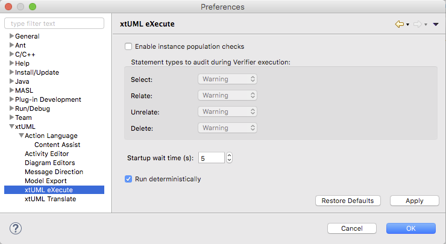

xtUML eXecute Preferences
========================

These preferences are control the activity of the Verifier (aka xtUML eXecute)
in the xtUML Debugging perspective.  

## Enable instance population checks

This preference instructs the Verifier how it should handle runtime checking of
instance populations processed by various OAL statements.  When the checks are 
enabled, each supported statement will be audited in the specified manner.   

The choices are:  
* __Ignore__: audit issues are completely ignored  
* __Warning__: audit issues generate a runtime warning
* __FATAL__: audit issues cause runtime execution to stop

## Startup wait time  

Specifies the amount of time (in seconds) to delay beginning execution after the
initial runtime population is created.  

## Run deterministically  

Enabling this option runs the entire system in one thread and utilizes simulated
(rather than wall-clock) time.  This makes model execution repeatable.   

Disabling this option runs each component in its own thread, and allows the user
to decide on the implementation of time used.  Thus, execution may differ from 
run to run.  This mode tests concurrency and can help expose race conditions.  

## Preference Page

    
